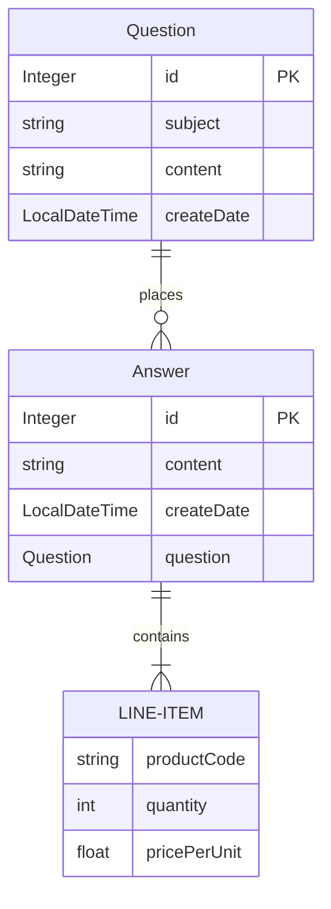

```mermaid
erDiagram
    Question {
        Integer id PK
        string subject
        string content
        LocalDateTime createDate
    }
    Answer {
        Integer id PK
        string content
        LocalDateTime createDate
        Question question
    }
    LINE-ITEM {
        string productCode
        int quantity
        float pricePerUnit
    }
    Question ||--o{ Answer : places
    Answer ||--|{ LINE-ITEM : contains    
```