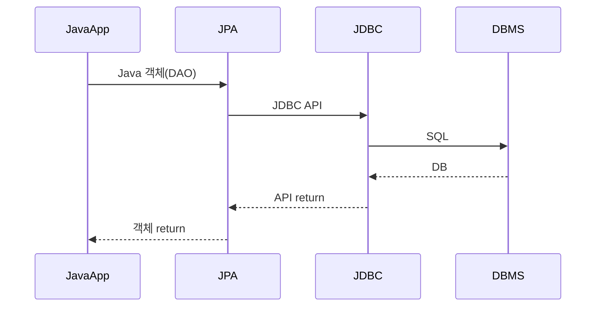

JDBC, JPA, ORM
-----------------------------
-----------------------------
### JDBC (Java Database Connectivity)
Java에서 제공하는 Java와 DB를 연결하는 API 
Java의 모든 DB연결은 JDBC를 통한다.
### ORM (Object Relational Mapping)
객체와 RDB 데이터를 자동으로 매핑해주는 프레임워크 
객체간 관계를 바탕으로 SQL문을 자동으로 생성해준다. 
(Java에 종속된 개념이 아니다.)
### JPA (Java Persistence API)
Java에서 제공하는 Java ORM 표준 인터페이스 
인터페이스이기 때문에 Hibernate와 같은별도의 구현체가 필요하다
### Hibernate
JPA 인터페이스의 Class에 해당하는 구현체
### Spring JPA
Spring에서 지원하는 JPA를 편하게 쓸 수 있게 도와주는 모듈 
JPA를 한단계 더 추상화한 Repository라는 인터페이스를 제공한다.
